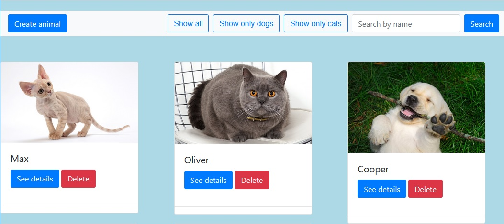

# Animal Store Project

## Project Overview
It's a Django project that created with learning purposes and shows MVT patter. I have used class based view to build а full CRUD on an animal. Also you can see in the project the use of forms for creating and updating, bootstrap for page visualization and the navbar, filtering and searching.
Below is an image on the home page:

